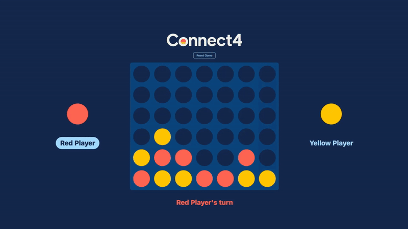

# 🎮 Connect 4 - Juego en React

Un clásico **4 en Raya** implementado con **React + Hooks**.  
Incluye animaciones de caída de fichas, detección automática de ganador y un modal final.


---

## 🚀 Demo

👉 *(Aquí puedes añadir una captura de pantalla o un gif mostrando la jugabilidad)*  



---

## ✨ Características

- 🎨 Interfaz simple y responsive con CSS.
- 🟡🔴 Colocación de fichas por columnas con animación de caída.
- 🏆 Detección de ganador en horizontal, vertical y diagonales.
- ❌ Reinicio de tablero con un solo click.
- 🪄 Modal de fin de partida con overlay que oscurece el fondo.
- ⚛️ Código modular con `custom hooks` y funciones puras de lógica.

---

## 📦 Instalación y uso

1. Clona este repositorio:
   ```bash
   git clone https://github.com/samuelpampi/Connect4.git
   cd Connect4

2. Instala dependencias:
   ```bash
   npm install

3. Inicializa el servidor:
   ```bash
   npm run build
   npm run preview

4. Abre el navegador:
   ```bash
   http://localhost:4173/

## 🛠️ Tecnologías usadas
React con Hooks (useState, useEffect, custom hooks)
CSS3 con Flexbox y Grid.
JavaScript (ES6+).
Vite como bundler.

## 📂 Estructura del proyecto

```bash
Connect4/
 ├─ public/                 # Recursos estáticos accesibles directamente (logo, imágenes, favicon, etc.)
 │   └─ img/                # Capturas de pantalla y gifs usados en el README
 │
 ├─ src/                    # Código fuente principal
 │   ├─ services/           # Custom Hooks
 │   ├─ components/         # Componentes UI
 │   ├─ lib/                # Lógica pura del juego 
 │   ├─ App.jsx             # Componente raíz de la aplicación
 │   └─ main.jsx            # Punto de entrada para ReactDOM
 │
 ├─ .gitignore              # Archivos y carpetas ignorados por Git
 ├─ package.json            # Dependencias y scripts del proyecto
 ├─ vite.config.js          # Configuración de Vite
 └─ README.md               # Documentación principal del proyecto